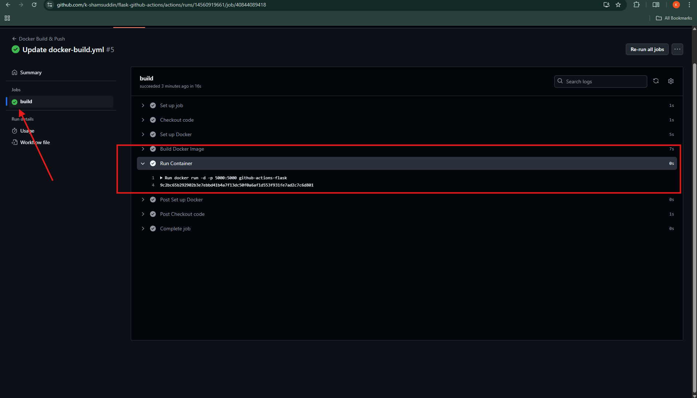

# 🚀 GitHub Actions CI/CD: Flask App + Docker

Welcome to `flask-github-actions` — a mini DevOps project where I set up a **CI/CD pipeline using GitHub Actions** that automatically builds and runs a **Dockerized Flask app** when code is pushed to the `master` branch.

---

## 🛠️ Technologies Used

- 🐍 Python + Flask  
- 🐳 Docker  
- ⚙️ GitHub Actions (CI/CD)

---

## 📂 Project Structure

flask-github-actions/ ├── app.py # Flask app ├── Dockerfile # Docker build file ├── .github/ │ └── workflows/ │ └── docker-build.yml # GitHub Actions workflow

---

## ⚙️ How It Works

1. You push your code to GitHub.
2. GitHub Actions:
   - Checks out the code
   - Builds a Docker image
   - Runs the Flask container

---

## 🎯 Output

Once the container is up and running, open `http://localhost:5000` to see:
Hello! this is GitHub Action + Docker, by Shams! <3.❤️

---

## 📸 Screenshots

### ✅ GitHub Actions Workflow Running

### ✅ Successful Container Run Log

---

## 🙋‍♂️ About Me

**Khaja Shamsuddin Ahmed**  
🚀 DevOps Learner | Cloud Enthusiast | CI/CD Explorer  

🔗 [LinkedIn](https://www.linkedin.com/in/khaja-shamsuddin-ahmed)  
💻 [GitHub](https://github.com/k-shamsuddin)

